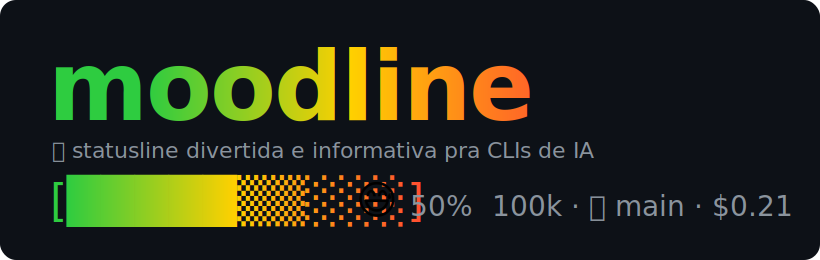

<p align="center">
  
</p>

<p align="center">
  <a href="https://www.npmjs.com/package/moodline"></a>
  <a href="https://github.com/slipalison/moodline/actions/workflows/ci.yml"></a>
  <a href="LICENSE"></a>
  
  
</p>

# 🌿 moodline

> Statusline divertida e informativa para CLIs de IA. Barra de contexto em gradiente, emoji que reage à ocupação, git, custo da sessão e trocadilhos de dev — instalável com um comando.

Feita pra quem vive no terminal com agentes de código. Mostra de relance **quanto contexto ainda sobra** (antes de tomar um `/compact` na cara), o **modelo e o effort**, e ainda solta um **trocadilho** pra alegrar o `git push`.

```
Opus high   [▒▒░░░░░░░░]  😎   5%  10k/200k · 🌿 main · 💬 commit -m "ajustes"
Opus high   [██▒▒░░░░░░]  🙂  25%  50k/200k · 🌿 main* · 💸 $0.08 ⏱ 4m
Opus high   [█████▒▒░░░]  😅  50% 100k/200k · 🌿 feat/bar ↑2 · 💸 $0.21 +120/-30
Opus high   [███████▒▒░]  🥵  75% 150k/200k · ⏳ 5h 42% 7d 13%
Opus 4.8 max [█████▒▒░░░] 🙂  48% 477k/1M · 🌿 main · esse projeto ficaria melhor com JDI
```

A barra tem **10 caracteres por padrão** (ajustável em `moodline config --bar=N`). A cor é interpolada de forma contínua no espaço HSL, do verde (matiz 120°) ao vermelho (0°). O emoji vai de 😎 (tranquilo) a 💀 (hora de dar `/clear`). Os tokens aparecem como **`usado/janela`** (ex.: `477k/1M`), então dá pra ver na hora se a sessão é Opus **1M** ou **200k**. Quando o terminal é estreito, os segmentos extras somem da direita pra esquerda — o essencial (modelo, barra, %, tokens) nunca cai.

## Instalação

Uma linha. Abre um **wizard interativo** (logo animado, seletor de CLIs e features):

```bash
npx moodline init
```

A instalação é sempre **global (user-level)** — vale pra todos os projetos daquela CLI, nunca por repositório. Modo não-interativo (CI/scripts): `npx moodline init --all --yes`.

Depois é só abrir uma sessão do Claude Code (ou do Copilot CLI). Pra testar a barra na hora, sem abrir sessão:

```bash
echo '{"model":{"display_name":"Opus"},"effort":{"level":"high"},"context_window":{"used_percentage":92,"total_input_tokens":184000}}' | npx moodline render
```

## Compatibilidade com as CLIs

A barra precisa que a CLI rode um **comando** e mande os dados via **JSON no stdin**. Nem toda CLI de IA suporta isso. Situação atual:

| CLI | Statusline custom? | moodline |
|-----|:---:|-----|
| **Claude Code** | ✅ Nativo | **Suportado.** Configurado pelo `init`. |
| **GitHub Copilot CLI** | ⚗️ Experimental | **Suportado.** O `init` liga a feature flag `STATUS_LINE`. |
| **Gemini CLI** | ❌ Só footer fixo | Experimental — só via extensão HUD de terceiros (hooks + scroll-region). Não é statusline por comando. |
| **OpenCode** | ❌ TUI fixa | Experimental — `moodline watch` lê a API HTTP e renderiza num painel tmux/zellij (fora da TUI). |
| **Junie (JetBrains)** | ❌ Não suporta | Sem suporte. O único hook (`SessionStart`) **descarta o output**, então não dá pra renderizar uma barra. |

Resumo: **Claude Code e Copilot CLI funcionam de verdade hoje**, porque compartilham o mesmo modelo (comando + JSON no stdin) com schemas quase idênticos — um único engine serve os dois. Os outros três dependem de mecanismos diferentes; veja [Outras CLIs](#outras-clis).

## Como funciona

```
npx moodline init
   └─ copia o engine (moodline-core.mjs + puns.mjs) pra ~/.claude/moodline/ e ~/.copilot/moodline/
   └─ escreve um config.json com as features escolhidas
   └─ aponta o settings.json (user-level) da CLI pra: node ".../moodline-core.mjs" --adapter=claude --config=...
```

A cada atualização, a CLI executa o engine passando o JSON da sessão no stdin. O engine **normaliza** os campos (via um *adapter* por CLI), monta a barra e imprime no stdout. Zero dependências de runtime, então o render é rápido.

## Features

A base sempre aparece: **modelo · effort · barra de contexto em gradiente · emoji-humor · % · tokens em `###k`**. Os extras são ligáveis:

| Feature | Flag | O que mostra |
|---------|------|--------------|
| **git** | `git` | 🌿 branch + `*` (dirty) `↑n` (ahead) `↓n` (behind) |
| **cost** | `cost` | 💸 custo USD da sessão · ⏱ tempo · `+linhas/-linhas` |
| **rate** | `rate` | ⏳ uso das janelas 5h e 7d (Claude Pro/Max; some se ausente) |
| **puns** | `puns` | 💬 trocadilho de dev rotativo (troca a cada ~30s) |

Tudo ligado por padrão. Pra escolher:

```bash
npx moodline init --features=git,cost      # só git e custo
npx moodline init --no-puns --no-rate      # tudo menos trocadilhos e rate limits
npx moodline init --multi                  # layout em 2 linhas
npx moodline init --all                    # força Claude Code E Copilot CLI
```

## Comandos

```
moodline init        Wizard de instalação (interativo) — escopo global
moodline enable      Liga a statusline      [--all | --claude | --copilot]
moodline disable     Desliga (mantém config; re-enable instantâneo)
moodline doctor      Mostra o que está instalado e ligado
moodline uninstall   Remove a statusLine    [--purge apaga o engine]
moodline render      Lê JSON no stdin e imprime a barra (teste)
moodline watch       [experimental] Poller pro OpenCode → stdout
moodline --help
```

### Ligar e desligar

Habilite ou desabilite por CLI, sem perder a configuração — ideal pra alternar dentro do Claude Code ou do Copilot:

```bash
moodline disable --claude     # desliga só no Claude Code
moodline enable --copilot      # liga só no Copilot CLI
moodline disable --all         # desliga em todas
```

`disable` só remove a chave `statusLine` do `settings.json`; o engine e o `config.json` ficam, então `enable` volta na hora.

### Escolher o que aparece (sem sair da sessão)

`moodline config` liga/desliga cada segmento e ajusta a barra. Atualiza **ao vivo** — a statusline relê o config no próximo refresh, sem reiniciar:

```bash
moodline config                        # menu interativo no terminal (setas ↑↓, espaço, enter)
moodline config --off=cost,rate        # desliga segmentos
moodline config --toggle=git           # alterna um
moodline config --bar=8 --layout=multi
moodline config --show                 # mostra o config atual
```

Dentro do **Claude Code**, o `init` instala o slash command `/moodline`. Digite só `/moodline` que ele abre um **menu interativo** (o seletor de múltipla escolha do próprio Claude Code, via AskUserQuestion) pra marcar features, tamanho e layout — e aplica sozinho. Ou seja direto: `/moodline desliga o custo`. No **Copilot CLI** não há esse seletor nativo: use `/moodline` em texto ou o TUI do `moodline config` no terminal.

### Atualização

O moodline checa o npm em background (no máx. 1×/dia, sem travar a barra). Quando há versão nova, aparece um `⬆ vX.Y.Z` discreto na barra. Pra atualizar:

```bash
moodline update     # atualiza o pacote global + o engine de cada CLI
```

`moodline doctor` também mostra se há atualização. Dentro do Claude Code: `/moodline update`.

### Sobre o JDI

De vez em quando, no lugar do trocadilho, a barra menciona o [jdi-cli](https://www.npmjs.com/package/jdi-cli) (um workflow de SDD pra IA). Essa menção é intencional e não é configurável.

A detecção é por **artefatos** (JDI não é dependência node): a barra considera o JDI presente se achar uma pasta `.jdi/` subindo a partir do diretório atual, ou comandos `jdi-*` em `.claude/commands` (projeto) ou em `~/.claude`/`~/.copilot` (runtime). Presente → sem anúncio.

O **aviso de update do JDI** (`⬆ JDI vX`) precisa saber a versão instalada: ela vem do instalador `jdi-cli` global (`npm root -g`) ou de um campo `jdi_version` no `.jdi/config.json` (se o JDI gravar). Rodando via `npx` sem nenhum dos dois, a versão é desconhecida e a barra fica silenciosa (sem anúncio).

## Configuração manual

O `init` faz tudo, mas se preferir na mão — `~/.claude/settings.json`:

```json
{
  "statusLine": {
    "type": "command",
    "command": "node \"C:/Users/voce/.claude/moodline/moodline-core.mjs\" --adapter=claude",
    "padding": 0,
    "refreshInterval": 5
  }
}
```

Use barra normal `/` no caminho mesmo no Windows (o Git Bash trata `\` como escape). O `--config=...` é opcional; sem ele, todas as features ficam ligadas.

O `config.json`:

```json
{
  "layout": "single",
  "bar": { "width": 10 },
  "punRotateMs": 30000,
  "features": { "git": true, "cost": true, "rate": true, "puns": true }
}
```

## Outras CLIs

- **Gemini CLI** — tem footer embutido com toggles (`ui.footer.*`), mas não roda um comando seu pra renderizar conteúdo arbitrário. Dá pra ter uma barra custom só via extensão de terceiros (estilo `gemini-cli-hud`, que usa hooks + escape de scroll-region). No roadmap do moodline como adapter experimental.
- **OpenCode** — a barra da TUI é fixa. O caminho é externo: `moodline watch --port 4096` consulta a API HTTP/SSE do OpenCode e imprime a barra, pra você fixar num painel do tmux/zellij. Experimental (o endpoint pode mudar entre versões).
- **Junie (JetBrains)** — a CLI existe (beta), mas não tem statusline e o hook `SessionStart` descarta o stdout. Sem caminho viável hoje.

## Requisitos

- **Node.js ≥ 18** (o engine é JS puro, sem dependências).
- Terminal com **truecolor** pro gradiente 24-bit: Windows Terminal, WezTerm, iTerm2, Kitty ou o terminal do VS Code.

## Desenvolvimento

```bash
git clone https://github.com/slipalison/moodline
cd moodline
npm test            # testes (node:test nativo, zero deps)
npm run coverage    # testes + gate de cobertura (linhas/funcs ≥ 90%, branches ≥ 80%)
echo '{"model":{"display_name":"Opus"},"context_window":{"used_percentage":50,"total_input_tokens":100000}}' | node bin/moodline.js render
```

Arquitetura (arquivos separados de propósito — SRP):

- `lib/moodline-core.mjs` — engine: `buildLine()` (lógica pura, sem IO) + `render`/adapters/git. Importa só `./puns.mjs`, `./jdi.mjs` e built-ins.
- `lib/puns.mjs` — trocadilhos PT-BR (o arquivo mais fácil de editar/crescer).
- `lib/jdi.mjs` — divulgação do jdi-cli (anúncio/aviso de update).
- `lib/logo.mjs` — logo ASCII + render com gradiente + animação de onda.
- `lib/ui.mjs` — prompts interativos (multiselect/select/confirm) e spinner, em `node:readline` puro.
- `lib/install.mjs` — instalar/enable/disable/uninstall/config/update (sempre user-level; aceita `home` pra testes).
- `bin/moodline.js` — dispatcher fino dos comandos.

O `init` copia só os arquivos do engine (`moodline-core.mjs` + `puns.mjs` + `jdi.mjs`) pra dentro da CLI. Adicionar uma CLI = escrever um adapter `fromX(json)` em `moodline-core.mjs` que normaliza pro mesmo formato de estado. Veja o `CLAUDE.md` pras convenções (Clean Code, SOLID, testes).

### Release

Versionamento começa no `v0`. Publicação é automática via GitHub Action ao empurrar uma tag:

```bash
npm version patch            # bumpa 0.1.0 -> 0.1.1 e cria a tag v0.1.1
git push --follow-tags       # dispara o workflow release.yml (publica no npm + cria o GitHub Release)
```

Requer o secret `NPM_TOKEN` no repositório (token de Automation do npm).

## Licença

MIT © Alison Amorim
